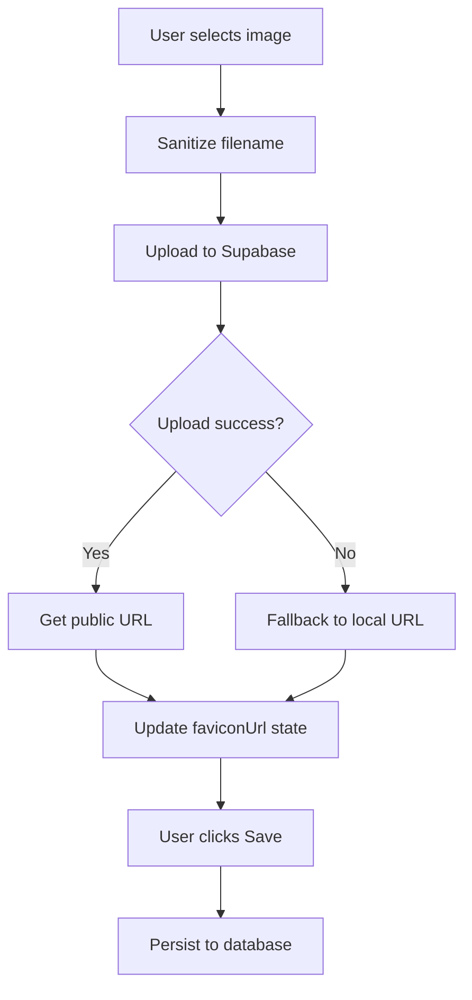
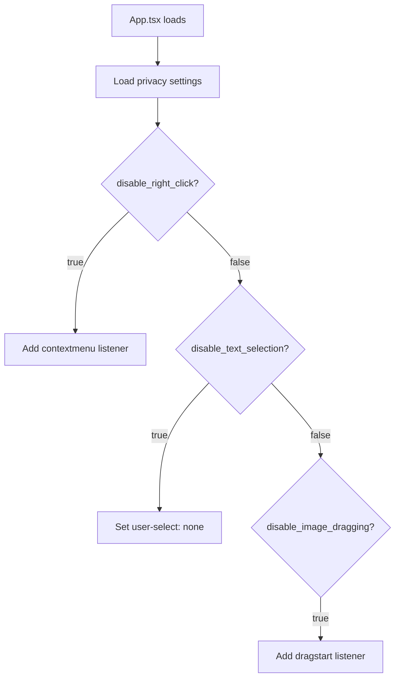

# Favicon and Privacy Settings Implementation

## Overview
Added three new features to the site admin panel:
1. **Favicon Customization** - Custom browser tab/bookmark icons
2. **Site Privacy Protection** - Basic content protection measures
3. **Enhanced CRECI Display** - Gold glowing effect for professional touch

## Features Implemented

### 1. Favicon Customization
Located in: `/admin/site-admin` → "Favicon" section

**Features:**
- Upload custom favicon images
- Paste URL to use existing favicon
- Live preview of current favicon
- Recommended size: 32x32 or 64x64 pixels
- Automatically updates browser tab icon

**Storage:**
- Uploaded to Supabase: `listings/favicon/`
- Filename format: `{timestamp}-{sanitized-filename}`
- Falls back to default `/stella-favicon.png`

**Usage:**
1. Navigate to Site Admin
2. Scroll to "Favicon" section
3. Either paste a URL or upload an image
4. Click "Save All Settings"
5. Refresh to see new favicon in browser tabs

### 2. Site Privacy & Protection
Located in: `/admin/site-admin` → "Site Privacy & Protection" section

**Three Protection Options:**

#### a) Disable Right-Click
- Prevents users from right-clicking to access context menus
- Blocks "Save Image As..." and "View Page Source" shortcuts
- Applied site-wide on all pages

#### b) Disable Text Selection
- Prevents users from selecting and copying text
- Uses CSS `user-select: none`
- Makes it harder to copy property descriptions

#### c) Disable Image Dragging
- Prevents drag-and-drop image saving
- Blocks `dragstart` event on all images
- Protects property photos from easy download

**Important Note:**
These are basic protection measures. The admin panel displays a warning:
> "These measures provide basic protection but are not foolproof. Determined users can still access content through browser developer tools or screenshots."

**Usage:**
1. Navigate to Site Admin
2. Scroll to "Site Privacy & Protection" section
3. Check desired protection options
4. Click "Save All Settings"
5. Refresh to apply changes

### 3. Enhanced CRECI Display
Located in: Header component (automatic)

**Visual Enhancement:**
- Changed from subtle gray to **gold/yellow color**
- Added **glowing effect** using text shadows
- Font weight increased to semi-bold
- Colors:
  - Light mode: `text-yellow-500`
  - Dark mode: `text-yellow-400`
- Glow effect: Double text-shadow for depth

**Styling:**
```css
text-yellow-500 dark:text-yellow-400
font-semibold
text-shadow: 
  0 0 8px rgba(234, 179, 8, 0.6),
  0 0 16px rgba(234, 179, 8, 0.3)
```

**Result:**
CRECI number now appears as a premium, professional certification badge with subtle glow.

## Technical Details

### Modified Files

1. **src/lib/siteSettings.ts**
   - Added 4 new setting keys:
     - `favicon_url`
     - `disable_right_click`
     - `disable_text_selection`
     - `disable_image_dragging`

2. **src/App.tsx**
   - Loads all 4 new settings on mount
   - Updates favicon dynamically via DOM manipulation
   - Adds event listeners for privacy protection:
     - `contextmenu` event prevention
     - `user-select` CSS application
     - `dragstart` event prevention for images

3. **src/pages/admin/SiteAdmin.tsx**
   - Added favicon configuration section with:
     - URL input field
     - File upload button
     - Preview display
     - Error handling
   - Added privacy settings section with:
     - 3 checkbox toggles
     - Descriptive labels
     - Warning message
   - Updated save function to persist all new settings

4. **src/components/Header.tsx**
   - Updated CRECI number styling:
     - Changed from `text-slate-500` to `text-yellow-500`
     - Added `font-semibold`
     - Added inline `textShadow` style for glow effect

### Database Schema
All settings stored in `site_settings` table:

| key                       | value             |
|---------------------------|-------------------|
| favicon_url               | URL string        |
| disable_right_click       | "true" or "false" |
| disable_text_selection    | "true" or "false" |
| disable_image_dragging    | "true" or "false" |

### Upload Flow (Favicon)



### Privacy Protection Flow



## Admin UI

### Favicon Section
```
┌─ Favicon ────────────────────────────────────────┐
│ The small icon that appears in browser tabs      │
│                                                   │
│ Favicon URL:                                      │
│ [https://...                                   ]  │
│ Paste a URL or upload an image                   │
│                                                   │
│ Upload Favicon Image:                             │
│ [Choose File]                                     │
│                                                   │
│ Current Favicon:    Preview:                      │
│ [🖼️ 32x32]          [🖼️ 32x32]                   │
└───────────────────────────────────────────────────┘
```

### Privacy Settings Section
```
┌─ Site Privacy & Protection ──────────────────────┐
│ Protect your content from being easily copied    │
│                                                   │
│ ☑ Disable Right-Click                            │
│   Prevents users from right-clicking...          │
│                                                   │
│ ☑ Disable Text Selection                         │
│   Prevents users from selecting...               │
│                                                   │
│ ☑ Disable Image Dragging                         │
│   Prevents users from dragging...                │
│                                                   │
│ ⚠️ Note: These measures provide basic protection │
│    but are not foolproof...                      │
└───────────────────────────────────────────────────┘
```

## Browser Compatibility

### Favicon
- ✅ All modern browsers (Chrome, Firefox, Safari, Edge)
- ✅ Mobile browsers (iOS Safari, Chrome Mobile)
- ✅ Automatic caching by browsers

### Privacy Settings
| Feature                    | Chrome | Firefox | Safari | Edge |
|----------------------------|--------|---------|--------|------|
| Disable Right-Click        | ✅     | ✅      | ✅     | ✅   |
| Disable Text Selection     | ✅     | ✅      | ✅     | ✅   |
| Disable Image Dragging     | ✅     | ✅      | ✅     | ✅   |

### CRECI Glow Effect
| Feature                    | Chrome | Firefox | Safari | Edge |
|----------------------------|--------|---------|--------|------|
| Text Shadow / Glow         | ✅     | ✅      | ✅     | ✅   |
| Yellow Color               | ✅     | ✅      | ✅     | ✅   |

## Testing

### Test Favicon
1. Upload a favicon in admin panel
2. Click "Save All Settings"
3. Open site in new tab
4. Check browser tab icon matches uploaded image

### Test Privacy Settings
1. Enable all 3 protection options
2. Click "Save All Settings"
3. Refresh the site
4. Try to:
   - Right-click (should be blocked)
   - Select text (should be disabled)
   - Drag images (should be prevented)

### Test CRECI Display
1. Navigate to any page with header
2. Look for CRECI number on desktop view
3. Verify gold color and subtle glow effect
4. Test in both light and dark modes

## Future Enhancements

### Potential Additions:
1. **Watermark Override per Image** - Allow disabling watermark for specific images
2. **Keyboard Shortcut Protection** - Block common screenshot shortcuts (harder to implement)
3. **DevTools Detection** - Detect when developer tools are open (controversial)
4. **Print Protection** - Disable or watermark printed pages
5. **Multiple Favicons** - Different sizes for different platforms (Apple Touch Icon, etc.)
6. **Favicon Generator** - Auto-generate different sizes from one upload

## Notes

- Favicon changes require browser refresh or cache clear
- Privacy settings apply globally to entire site
- CRECI glow effect is subtle for professional appearance
- All settings work together seamlessly
- No performance impact from these features

## Related Documentation

- [Watermark System](./WATERMARK_SIZE_AND_HERO_LOGO.md)
- [Logo Customization](./HEADER_FOOTER_LOGO_CUSTOMIZATION.md)
- [Site Admin Panel](./admin/README.md)
